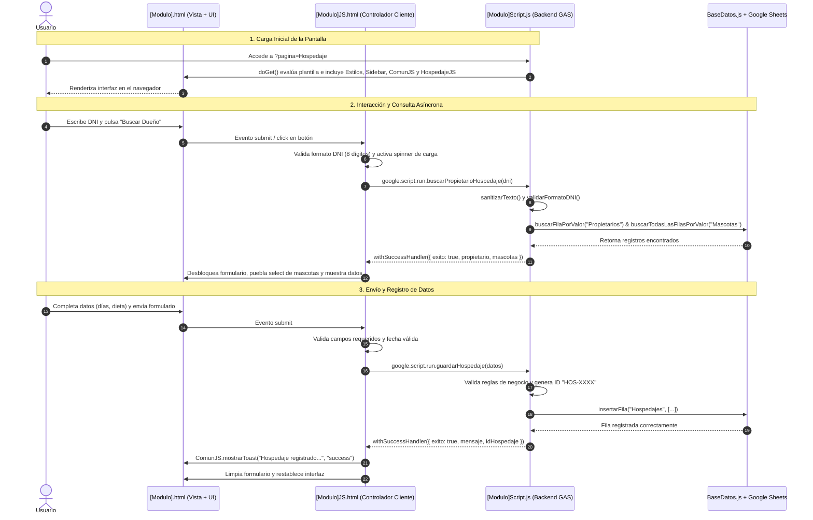

# Documentación de Arquitectura y Estructura del Proyecto VetCare

  

## 1. Visión General de la Arquitectura

  

El proyecto **VetCare** está diseñado bajo una arquitectura modular y desacoplada adaptada a las particularidades y restricciones de **Google Apps Script (GAS)** y **HTML Service**.

  

Para evitar la repetición de código ("código espagueti") y garantizar la mantenibilidad, escalabilidad y legibilidad, el sistema se organiza en tres pilares fundamentales:

  

1. **Regla de 3 Archivos por Módulo/Vista (Patrón MVC Adaptado)**: Para cada pantalla funcional del sistema existe estrictamente un trío de archivos:

   - `[Modulo].html` (Estructura visual / Vista)

   - `[Modulo]JS.html` (Controlador e interactividad de cliente)

   - `[Modulo]Script.js` (Servicios y reglas de negocio en el backend)

2. **Capa Transversal de Componentes Compartidos (Frontend)**: Elementos comunes de diseño, navegación y utilidades de cliente (`Sidebar.html`, `Estilos.html`, `ComunJS.html`).

3. **Capa Transversal de Servicios y Base de Datos (Backend)**: Conexión centralizada a Google Sheets, constantes globales, enrutador principal y validadores (`Config.js`, `BaseDatos.js`, `Validadores.js`, `Código.js`).

  

---

  

## 2. Justificación Arquitectónica: ¿Por Qué se Dividió en 3 Archivos por Página?

  

En el entorno de desarrollo de **Google Apps Script con HTML Service**, no existen de forma nativa empaquetadores modernos (como Webpack, Vite o Rollup) ni soporte directo para módulos ES6 (`import`/`export`) entre el cliente y el servidor. Tradicionalmente, esto provocaba que muchos desarrolladores concentraran HTML, CSS, JavaScript del navegador y llamadas a Google Sheets dentro de un único archivo monolítico de miles de líneas.

  

Para resolver esto de forma profesional y ordenada, se implementó el patrón de **3 archivos por módulo**:

  

```

┌─────────────────────────────────────────────────────────────────────────┐

│                           MÓDULO FUNCIONAL                              │

│                                                                         │

│   ┌─────────────────────┐   include    ┌────────────────────────────┐   │

│   │    [Modulo].html    │◄─────────────┤      [Modulo]JS.html       │   │

│   │   (Estructura UI)   │              │   (Controlador Cliente)    │   │

│   └──────────┬──────────┘              └─────────────┬──────────────┘   │

└──────────────┼───────────────────────────────────────┼──────────────────┘

               │ Render HTML                           │ google.script.run

               ▼                                       ▼

┌─────────────────────────┐              ┌────────────────────────────┐

│   Navegador (Usuario)   │              │     [Modulo]Script.js      │

│                         │              │   (Servicio en Servidor)   │

└─────────────────────────┘              └─────────────┬──────────────┘

                                                       │ SpreadsheetApp

                                                       ▼

                                         ┌────────────────────────────┐

                                         │  Base de Datos (Sheets)    │

                                         └────────────────────────────┘

```

  

### Detalle de Responsabilidades de los 3 Archivos:

  

#### 1. `[Modulo].html` — Capa de Estructura y Presentación (Vista)

- **Responsabilidad**: Define el esqueleto y la composición visual de la interfaz de usuario en HTML5 puro utilizando las clases utilitarias de **Tailwind CSS** y componentes de **DaisyUI**.

- **Qué hace**:

  - Declara formularios, tarjetas de métricas, tablas de datos, botones y modales.

  - Asigna identificadores del DOM (`id="..."`) que servirán de puntos de inserción para los datos.

  - Inyecta los componentes reutilizables mediante directivas de plantilla evaluadas en el servidor:

    - `<?!= incluir('Estilos'); ?>`

    - `<?!= incluir('Sidebar'); ?>`

    - `<?!= incluir('ComunJS'); ?>`

    - `<?!= incluir('[Modulo]JS'); ?>`

- **Por qué existe separado**: Mantiene el marcado HTML limpio, legible y enfocado exclusivamente en la estructura visual sin ensuciarlo con lógica de programación o funciones de backend.

  

#### 2. `[Modulo]JS.html` — Capa de Controlador e Interacción en Cliente (Frontend Controller)

- **Responsabilidad**: Gestiona toda la lógica que se ejecuta dentro del navegador del usuario.

- **Qué hace**:

  - Escucha y responde a eventos del DOM (clics en botones, envíos de formulario con `onsubmit`, pulsaciones de tecla como `Enter`, cambios en `<select>`).

  - Realiza validaciones inmediatas en el cliente (formato de DNI de 8 dígitos, campos requeridos, fechas mínimas) para ofrecer una respuesta instantánea sin sobrecargar el servidor.

  - Controla los estados de la interfaz (mostrar spinners de carga `loading-spinner`, deshabilitar botones para evitar envíos dobles, alternar visibilidad de pasos, prellenar campos).

  - Se comunica de manera asíncrona con el servidor mediante el puente de GAS `google.script.run`, utilizando callbacks de éxito `.withSuccessHandler()` y de fallo `.withFailureHandler()`.

  - Muestra notificaciones flotantes contextuales invocando a `mostrarToast()`.

- **Por qué existe separado**: En GAS, los archivos `.js` se ejecutan en el servidor; el código JavaScript del navegador debe residir dentro de un archivo `.html` envuelto en etiquetas `<script>`. Aislarlo en `[Modulo]JS.html` evita mezclar el comportamiento interactivo con la estructura visual de `[Modulo].html`.

  

#### 3. `[Modulo]Script.js` — Capa de Servicios y Reglas de Negocio (Backend Service)

- **Responsabilidad**: Contiene las funciones del servidor que se ejecutan en el entorno V8 de Google Apps Script.

- **Qué hace**:

  - Actúa como la "API interna" o endpoint al que llama `google.script.run` desde el cliente.

  - Aplica validaciones estrictas en el servidor (sanitización de cadenas, expresiones regulares con `Validadores.js`, comprobación de duplicados y coherencia de datos).

  - Genera identificadores únicos para cada entidad del sistema (`MAS-XXXX`, `CIT-XXXX`, `REC-XXXX`, `HOS-XXXX`).

  - Lee, busca, filtra, inserta y actualiza registros en las hojas de cálculo correspondientes a través de `BaseDatos.js`.

  - Retorna objetos JavaScript normalizados con indicadores de estado (`{ exito: true, ... }` o `{ error: "..." }`).

- **Por qué existe separado**: Garantiza la seguridad e integridad del sistema. El cliente nunca debe acceder directamente a la base de datos de Google Sheets ni ejecutar lógica crítica de negocio en el navegador.

  

### Beneficios Principales de esta División:

1. **Separación de Responsabilidades (Separation of Concerns - SoC)**: Cada archivo tiene un único motivo para cambiar. Si cambia el diseño, se toca el `.html`; si cambia la validación del formulario en vivo, se toca el `JS.html`; si cambia la lógica de guardado en base de datos, se toca el `Script.js`.

2. **Mantenibilidad y Escalabilidad**: El proyecto no contiene archivos monolíticos difíciles de depurar; cada archivo tiene entre 50 y 200 líneas de código conciso y especializado.

3. **Colaboración sin Conflictos en Git**: Facilita el trabajo colaborativo en equipo, reduciendo significativamente los conflictos de fusión (*merge conflicts*) en sistemas de control de versiones.

4. **Seguridad Robusta**: Doble capa de validación (rápida en cliente para UX, estricta en backend para integridad de datos).

  

---

  

## 3. Mapa Completo de Archivos del Proyecto

  

```text

📁 veterinaria/

├── 📄 .clasp.json                   -> Configuración de sincronización local con Google Apps Script

├── 📄 appsscript.json               -> Manifiesto de configuración de GAS (zona horaria, permisos)

│

├── ⚙️ BACKEND - CAPA TRANSVERSAL Y ENRUTAMIENTO

│   ├── 📄 Config.js                 -> Constantes globales del sistema (ID de la hoja de cálculo)

│   ├── 📄 BaseDatos.js              -> Capa de acceso a datos CRUD en Google Sheets

│   ├── 📄 Validadores.js            -> Sanitización, validaciones y formateadores de fechas/horas

│   └── 📄 Código.js                 -> Enrutador principal (doGet) y helper de inclusión (incluir)

│

├── 🎨 FRONTEND - COMPONENTES Y UTILIDADES COMPARTIDAS

│   ├── 📄 Estilos.html              -> CDN Tailwind CSS, DaisyUI v4, Google Fonts y Lucide Icons

│   ├── 📄 Sidebar.html              -> Menú lateral de navegación con resaltado automático de página

│   └── 📄 ComunJS.html              -> Funciones cliente compartidas (irPagina, escaparHTML, mostrarToast)

│

├── 📊 MÓDULO 1: DASHBOARD

│   ├── 📄 Dashboard.html            -> Vista con tarjetas KPI, lista de próximas citas y clientes recientes

│   ├── 📄 DashboardJS.html          -> Petición y renderizado dinámico de métricas en el cliente

│   └── 📄 DashboardScript.js        -> Backend: cálculo de contadores, filtros y ordenamiento de citas

│

├── 📝 MÓDULO 2: REGISTRO

│   ├── 📄 Registro.html             -> Formulario interactivo en 2 pasos (Propietario -> Mascota)

│   ├── 📄 RegistroJS.html           -> Validación de pasos, alternancia de vacunas caninas/felinas

│   └── 📄 RegistroScript.js         -> Backend: verificación de duplicados por DNI y generación de ID MAS-XXXX

│

├── 👥 MÓDULO 3: ADMINISTRACIÓN

│   ├── 📄 Administracion.html        -> Directorio de clientes con buscador y modales (editar, mascota, borrar)

│   ├── 📄 AdministracionJS.html      -> Búsqueda en vivo, apertura de modales y gestión de acciones

│   └── 📄 AdministracionScript.js    -> Backend: consulta relacional, actualización y borrado en cascada

│

├── 📅 MÓDULO 4: CITAS

│   ├── 📄 Citas.html                -> Formulario en 2 pasos para agendar citas médicas con búsqueda por DNI

│   ├── 📄 CitasJS.html              -> Búsqueda de dueño, carga de mascotas y envío asíncrono

│   └── 📄 CitasScript.js            -> Backend: validación de fechas, generación de ID CIT-XXXX y registro

│

├── 🚚 MÓDULO 5: RECOJO A DOMICILIO

│   ├── 📄 Recojo.html               -> Formulario para programar recojo domiciliario vinculado a citas activas

│   ├── 📄 RecojoJS.html             -> Búsqueda por DNI, selección de cita disponible y prellenado de dirección

│   └── 📄 RecojoScript.js           -> Backend: filtrado de citas sin recojo, generación de ID REC-XXXX y guardado

│

└── 🏠 MÓDULO 6: HOSPEDAJE DE MASCOTAS

    ├── 📄 Hospedaje.html            -> Formulario para reserva de estadía de mascotas con cuidados especiales

    ├── 📄 HospedajeJS.html          -> Búsqueda de dueño, visualización de alergias y control de fechas

    └── 📄 HospedajeScript.js        -> Backend: validación de estadía/dieta, creación de hoja y código HOS-XXXX

```

  

---

  

## 4. Detalle Archivo por Archivo: Qué Contiene y Por Qué Existe

  

### A. Capa Transversal del Backend

  

#### 1. `Config.js`

- **Qué contiene**:

  - Constante global `ID_DOCUMENTO = "1yoG9y4dxpwqIZuSca_9_moJeEOAxRSEQyaBuSwxcBF8"`.

- **Por qué existe**: Centraliza el identificador de la hoja de cálculo de Google Sheets utilizada como base de datos relacional. Si la hoja cambia de ID o se migra a otro entorno, solo se modifica esta línea en lugar de revisar decenas de archivos.

  

#### 2. `BaseDatos.js`

- **Qué contiene**:

  - `obtenerHoja(nombreHoja)`: Abre la hoja por ID o la crea automáticamente con sus cabeceras correspondientes si aún no existe (`Propietarios`, `Mascotas`, `Citas`, `Recojos`).

  - `obtenerFilasDatos(nombreHoja)`: Extrae todos los datos de la hoja omitiendo la fila de encabezados.

  - `buscarFilaPorValor(nombreHoja, indiceColumna, valor)`: Realiza una búsqueda lineal (insensible a mayúsculas/minúsculas) de la primera fila coincidente.

  - `buscarTodasLasFilasPorValor(nombreHoja, indiceColumna, valor)`: Retorna un arreglo con todas las filas que cumplan una condición (ej. todas las mascotas de un propietario).

  - `insertarFila(nombreHoja, filaDatos)`: Agrega un nuevo registro al final de la hoja mediante `appendRow`.

- **Por qué existe**: Encapsula y aísla todas las operaciones con la API de `SpreadsheetApp`. Provee una interfaz unificada de acceso a datos que previene errores de rango y lectura de encabezados.

  

#### 3. `Validadores.js`

- **Qué contiene**:

  - `sanitizarTexto(valor)`: Normaliza entradas eliminando espacios en blanco y protegiendo contra valores nulos o indefinidos.

  - `validarFormatoDNI(dni)`: Verifica estrictamente que el DNI contenga 8 dígitos numéricos mediante expresión regular (`/^\d{8}$/`).

  - `validarFormatoTelefono(telefono)`: Verifica que el teléfono contenga 9 dígitos numéricos (`/^\d{9}$/`).

  - `validarFormatoCorreo(correo)`: Valida la estructura de correo electrónico cuando ha sido proporcionado (campo opcional).

  - `formatearFecha(valor)`: Convierte fechas a formato legible `dd/MM/yyyy` según la zona horaria del documento.

  - `formatearFechaInput(valor)`: Adapta fechas al estándar `yyyy-MM-dd` requerido por los campos `<input type="date">`.

  - `formatearHora(valor, zonaHoraria)`: Formatea valores de hora al estándar `HH:mm`.

- **Por qué existe**: Centraliza y estandariza todas las reglas de negocio y formateo. Cualquier módulo que requiera validar o dar formato utiliza estas funciones, garantizando homogeneidad y evitando código duplicado.

  

#### 4. `Código.js`

- **Qué contiene**:

  - `doGet(e)`: Enrutador frontal (Front Controller) de la aplicación web. Lee el parámetro de URL `?pagina=...`, valida si se encuentra dentro del diccionario de páginas permitidas (`Dashboard`, `Registro`, `Administracion`, `Citas`, `Recojo`, `Hospedaje`) y sirve la plantilla correspondiente (redireccionando a `Dashboard` por defecto). Pasa variables de entorno (`urlApp`, `paginaActual`) y configura el título y viewport.

  - `incluir(nombreArchivo)`: Función utilitaria que carga e incrusta el contenido de archivos parciales (`HtmlService.createHtmlOutputFromFile(nombreArchivo).getContent()`).

- **Por qué existe**: Es el punto de entrada obligatorio en Google Apps Script para aplicaciones Web Apps bajo `HtmlService`.

  

---

  

### B. Capa Transversal del Frontend

  

#### 5. `Estilos.html`

- **Qué contiene**:

  - Tipografía oficial Google Fonts (*Roboto*).

  - Framework CSS Tailwind vía CDN con extensión de tema personalizado (colores corporativos `brand: #026dd5` y `brand-dark: #0154a6`).

  - Componentes de interfaz de usuario de **DaisyUI v4**.

  - Librería de iconografía vectorial **Lucide Icons**.

- **Por qué existe**: Garantiza coherencia visual en todo el sistema. Si se requiere modificar el esquema de color corporativo o actualizar librerías UI, se realiza en un único lugar.

  

#### 6. `Sidebar.html`

- **Qué contiene**:

  - Menú lateral de navegación responsivo con logotipo de VetCare.

  - Botones de acceso directo a los 6 módulos: Dashboard, Registro, Administración, Citas, Recojo y Hospedaje.

  - Script autoejecutable (`resaltarNavActual`) que identifica la variable `window.PAGINA_ACTUAL` y resalta automáticamente la opción activa con estilo visual destacado.

- **Por qué existe**: Elimina cientos de líneas de HTML repetido entre vistas y asegura que la navegación sea idéntica en toda la aplicación.

  

#### 7. `ComunJS.html`

- **Qué contiene**:

  - `irPagina(pagina)`: Navegación entre vistas sin recargas completas destructivas, redirigiendo a la URL del Web App (`window.top.location.href = urlApp + '?pagina=' + pagina`).

  - `escaparHTML(valor)`: Sanitizador del lado del cliente que convierte caracteres especiales (`&`, `<`, `>`, `"`, `'`) en entidades HTML seguras, previniendo ataques de Cross-Site Scripting (XSS).

  - `mostrarToast(mensaje, tipo)`: Crea dinámicamente notificaciones emergentes modernas (éxito, error, alerta, información) con temporizador de desvanecimiento y eliminación automática a los 3.5 segundos.

- **Por qué existe**: Proporciona herramientas de experiencia de usuario reutilizables para todos los controladores de cliente.

  

---

  

### C. Módulos Funcionales (Patrón de 3 Archivos)

  

#### MÓDULO 1: DASHBOARD

- **`Dashboard.html`**: Estructura de la pantalla principal con 4 tarjetas de indicadores (Total Mascotas, Perros, Gatos, Total Citas), panel de "Próximas Citas" con insignias de estado y panel de "Clientes Recientes".

- **`DashboardJS.html`**: Se ejecuta al cargar la página (`DOMContentLoaded`), invoca a `google.script.run.obtenerDatosDashboard()`, gestiona estados de carga (esqueletos visuales) y puebla dinámicamente las métricas y listas en el DOM.

- **`DashboardScript.js`**: Endpoint `obtenerDatosDashboard()` en el servidor. Lee las hojas `Propietarios`, `Mascotas` y `Citas`, calcula totales desagregados por especie, ordena las citas cronológicamente y devuelve el resumen para la interfaz.

  

#### MÓDULO 2: REGISTRO

- **`Registro.html`**: Formulario interactivo estructurado en 2 fases secuenciales. Fase 1: Datos del Propietario (DNI, Nombre, Fecha Nacimiento, Teléfono, Dirección, Correo). Fase 2: Datos de la Mascota (Tipo perro/gato, Nombre, Raza, Edad, Alergias, Esquema de vacunas).

- **`RegistroJS.html`**: Controla la experiencia de usuario: valida datos en cliente, envía el propietario con `registrarPropietario()`, bloquea la Fase 1 una vez guardada, desbloquea la Fase 2, conmuta dinámicamente las listas de vacunas según la especie seleccionada (caninas vs. felinas) y envía la mascota con `registrarMascota()`.

- **`RegistroScript.js`**: Endpoints de backend:

  - `registrarPropietario(datos)`: Valida unicidad del DNI antes de insertar en la hoja `Propietarios`.

  - `registrarMascota(datos)`: Asocia la mascota al DNI del dueño, genera el identificador único `MAS-XXXX` y guarda el registro en la hoja `Mascotas`.

  

#### MÓDULO 3: ADMINISTRACIÓN

- **`Administracion.html`**: Directorio integral de clientes con tabla responsiva, buscador en tiempo real y tres ventanas modales: "Editar Propietario", "Agregar Mascota Adicional" y "Confirmar Eliminación".

- **`AdministracionJS.html`**: Gestiona la carga de la tabla (`obtenerPropietariosAdministracion`), filtrado instantáneo en memoria por texto o DNI, precarga de datos en modales (`showModal()`), y gestión de respuestas de actualización o borrado.

- **`AdministracionScript.js`**: Endpoints de backend:

  - `obtenerPropietariosAdministracion()`: Cruza relacionalmente propietarios con sus respectivas mascotas y retorna la lista combinada.

  - `actualizarPropietarioAdministracion(datos)`: Localiza la fila por DNI y actualiza los datos de contacto del cliente.

  - `agregarMascotaAdministracion(datos)`: Registra una nueva mascota vinculada a un cliente existente.

  - `eliminarPropietarioAdministracion(dni)`: Ejecuta borrado en cascada (elimina al dueño de `Propietarios` y todas sus mascotas asociadas de `Mascotas`).

  

#### MÓDULO 4: CITAS

- **`Citas.html`**: Formulario en 2 pasos para agendar citas médicas. Paso 1: Búsqueda del propietario por DNI. Paso 2: Selección de mascota, tipo de servicio (Consulta General, Vacunación, Desparasitación, Cirugía, Baño y Corte), fecha, hora y observaciones.

- **`CitasJS.html`**: Captura evento de búsqueda por DNI o Enter, ejecuta `buscarPorDni(dni)`, puebla el selector de mascotas, valida que la fecha no sea anterior a hoy y envía la cita mediante `guardarCita(datos)`.

- **`CitasScript.js`**: Endpoints de backend:

  - `buscarPorDni(dni)`: Valida DNI, busca al dueño en `Propietarios` y retorna sus mascotas registradas desde `Mascotas`.

  - `guardarCita(datos)`: Valida que la fecha y hora no sean pasadas, genera el identificador único `CIT-XXXX` y guarda la cita en la hoja `Citas` con estado inicial "Pendiente".

  

#### MÓDULO 5: RECOJO A DOMICILIO

- **`Recojo.html`**: Interfaz para programar traslados y recojo a domicilio de mascotas que cuentan con una cita previa. Paso 1: Búsqueda de propietario por DNI. Paso 2: Selector de cita médica activa, dirección de recojo (prellenada pero editable), referencia del domicilio y observaciones para el conductor.

- **`RecojoJS.html`**: Controlador que gestiona la búsqueda del cliente mediante `buscarCitasParaRecojo(dni)`, puebla el desplegable de citas con formato descriptivo (`Fecha · Hora · Mascota · Servicio`), autocompleta la dirección registrada del dueño, valida campos y envía la solicitud a `guardarRecojo(datos)`.

- **`RecojoScript.js`**: Endpoints de backend:

  - `buscarCitasParaRecojo(dni)`: Busca al dueño y todas sus citas en `Citas`. Cruza con la hoja `Recojos` para excluir citas canceladas o citas que ya cuenten con un servicio de recojo registrado previamente.

  - `guardarRecojo(datos)`: Comprueba la validez de la cita, verifica que no exista un recojo duplicado para la misma cita, genera el identificador `REC-XXXX` e inserta el servicio en la hoja `Recojos` con estado "Pendiente".

  

#### MÓDULO 6: HOSPEDAJE DE MASCOTAS

- **`Hospedaje.html`**: Formulario para la reserva y gestión de estadías de mascotas en la clínica. Paso 1: Búsqueda del dueño por DNI. Paso 2: Selección de mascota, visualizador de alergias registradas, fecha de ingreso, cantidad de días de estancia, tipo de alimentación (Alimento seco, Alimento húmedo, Dieta casera, Dieta especial, Alimento del dueño), instrucciones especiales y teléfono de emergencia.

- **`HospedajeJS.html`**: Controla la búsqueda de clientes con `buscarPropietarioHospedaje(dni)`, asocia las alergias de cada mascota a atributos de datos (`data-alergias`) para mostrarlas al seleccionarla, bloquea fechas pasadas en el selector de fecha y procesa la reserva con `guardarHospedaje(datos)`.

- **`HospedajeScript.js`**: Endpoints de backend:

  - `buscarPropietarioHospedaje(dni)`: Obtiene los datos del propietario y la lista detallada de sus mascotas con raza y condiciones de salud/alergias.

  - `guardarHospedaje(datos)`: Valida que la fecha no sea retroactiva, verifica que los días sean un entero positivo, valida opciones de alimentación permitidas, asegura la existencia de la hoja `Hospedajes` con sus encabezados si fuese necesario, genera el código `HOS-XXXX` e inserta la reserva con estado "Reservado".

  

---

  

## 5. Matriz de Base de Datos (Estructura de Hojas de Google Sheets)

  

El sistema utiliza Google Sheets como base de datos relacional orientada a filas:

  

| Hoja | Columnas / Estructura de Campos | Propósito |

| :--- | :--- | :--- |

| **`Propietarios`** | `DNI`, `Nombre`, `Fecha Nacimiento`, `Teléfono`, `Dirección`, `Correo`, `Fecha Registro` | Registro principal de clientes de la veterinaria. |

| **`Mascotas`** | `ID Mascota`, `DNI Dueño`, `Tipo`, `Nombre`, `Raza`, `Edad`, `Alergias`, `Vacunas`, `Fecha Registro` | Registro de pacientes veterinarios vinculados por `DNI Dueño`. |

| **`Citas`** | `ID Cita`, `DNI Dueño`, `ID Mascota`, `Tipo Cita`, `Fecha`, `Hora`, `Observaciones`, `Estado`, `Fecha Registro` | Agendamiento de citas médicas clínicas vinculadas a mascota y dueño. |

| **`Recojos`** | `ID Recojo`, `DNI Dueño`, `ID Cita`, `Dirección`, `Referencia`, `Observaciones`, `Estado`, `Fecha Registro` | Logística de transporte domiciliario vinculado a una cita existente. |

| **`Hospedajes`** | `ID Hospedaje`, `DNI Dueño`, `Nombre Propietario`, `ID Mascota`, `Nombre Mascota`, `Fecha Ingreso`, `Cantidad Días`, `Alimentación`, `Instrucciones`, `Contacto Emergencia`, `Estado`, `Fecha Registro` | Reservas de estancia, alimentación y cuidados temporales. |

  

---

  

## 6. Flujo de Comunicación Cliente - Servidor

  

El siguiente diagrama ilustra el flujo de ejecución típico entre las tres capas:

  



  

---

  

## 7. Guía para Agregar un Nuevo Módulo en el Futuro

  

Para expandir el sistema con una nueva funcionalidad (por ejemplo, `Inventario` o `HistorialMedico`):

  

1. **Crear el trío de archivos del módulo**:

   - `[NuevoModulo].html`: Estructura visual. Debe incluir al inicio `Estilos`, el `Sidebar`, `ComunJS` y al final `[NuevoModulo]JS`.

   - `[NuevoModulo]JS.html`: Código dentro de `<script>` con eventos del DOM, validaciones de interfaz y llamadas a `google.script.run`.

   - `[NuevoModulo]Script.js`: Endpoints del servidor con validaciones robustas y llamadas a `BaseDatos.js`.

2. **Registrar la página en `Código.js`**:

   - Agregar la nueva entrada al objeto `paginasPermitidas` dentro de `doGet(e)`:

     ```javascript

     var paginasPermitidas = {

       Dashboard: "Dashboard",

       Registro: "Registro",

       Administracion: "Administracion",

       Citas: "Citas",

       Recojo: "Recojo",

       Hospedaje: "Hospedaje",

       NuevoModulo: "NuevoModulo" // <-- Agregar aquí

     };

     ```

3. **Añadir el botón de navegación en `Sidebar.html`**:

   - Agregar el elemento de navegación con su icono correspondiente de Lucide:

     ```html

     <button

       onclick="irPagina('NuevoModulo')"

       data-pagina="NuevoModulo"

       class="nav-item flex w-full items-center gap-3 rounded-xl px-4 py-3 text-sm font-medium text-slate-600 hover:bg-slate-50 transition-colors"

     >

       <i data-lucide="box" class="h-5 w-5"></i>

       <span>Nuevo Módulo</span>

     </button>

     ```

4. **Registrar la estructura de la hoja en `BaseDatos.js` (si aplica)**:

   - Si el nuevo módulo gestiona una nueva tabla en Google Sheets, agregar su inicialización de cabeceras en `obtenerHoja(nombreHoja)`:

     ```javascript

     } else if (nombreHoja === "Inventario") {

       hoja.appendRow(["ID Producto", "Nombre", "Categoría", "Stock", "Precio", "Fecha Registro"]);

     }

     ```


https://docs.google.com/spreadsheets/d/1yoG9y4dxpwqIZuSca_9_moJeEOAxRSEQyaBuSwxcBF8/edit?usp=sharing